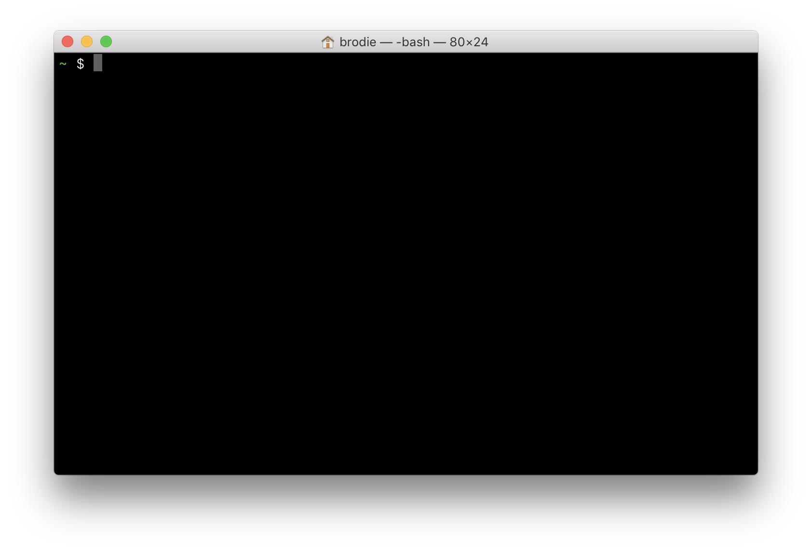

# Brodie's dotfiles

## Bash

1. [Setup Dropbox](https://www.dropbox.com/help/desktop-web/download-dropbox)
2. `ln -s ~/Dropbox/Repos/dotfiles/.bash_profile . && ln -s ~/Dropbox/Repos/dotfiles/.hushlogin .`
3. [There is no step 3](https://www.youtube.com/watch?v=6uXJlX50Lj8).

## SSH

1. `cd ~/.ssh && ln -s ~/Dropbox/Repos/dotfiles/config .` (N.B. for obvious reasons, this doesn't live here)
